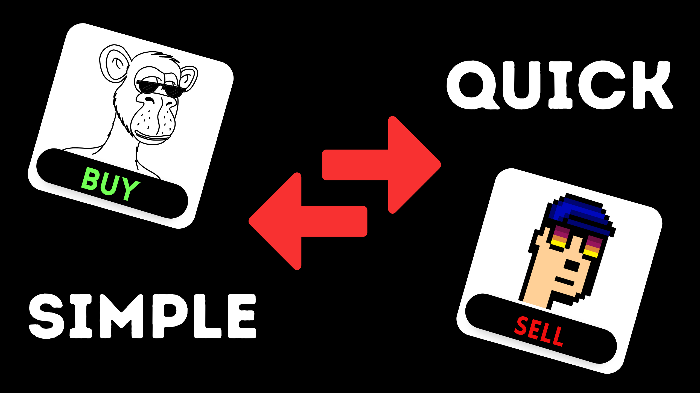

## NFT Marketplace Contract 💪
✅ This is an amazing NFT marketplace contract  
✅ I've built a marketplace which traded over 2000$+ volume with this contract.

 

### A Quick Walkthrough
The contract uses OpenZeppelin libraries for the ERC721 token and URI storage, as well as the Counters library for generating unique token IDs. It also uses the ReentrancyGuard contract to prevent reentrant attacks.

The contract defines a struct called MarketItem, which stores information about each NFT listed for sale, such as its token ID, seller, owner, price, and whether it is listed for sale. The contract also defines several state variables, including the owner of the contract, the total number of items in the marketplace, the number of items currently listed for sale, and the total volume of sales.

### Functions

The contract includes several functions for buying and selling NFTs, including listMarketItem(), createMarketSale(), resellToken(), and removeListing(). These functions allow users to list an NFT for sale, purchase an NFT, relist an NFT, and remove a listing, respectively. The contract also includes functions for updating the price of an NFT and getting the current price of an NFT.

Overall, this contract provides a simple implementation of an NFT marketplace where users can buy and sell NFTs.
